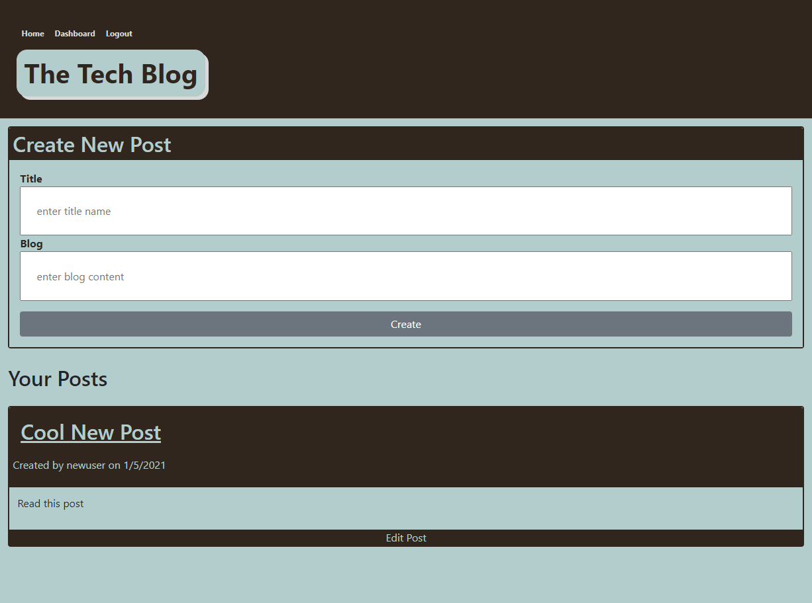
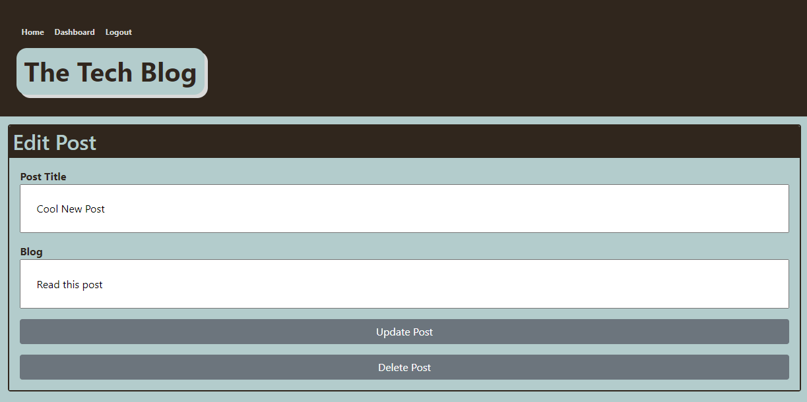

# mvc-tech-blog

## Purpose

Build a CMS-style blog site similar to a Wordpress site, where developers can publish their blog posts and comment on other developer' posts as well. The app should follow the MVD paradigm in its architectural structure, using Handlebars.js as the templating language, Sequilize as the ORM and the express-session npm package for authentication.

## User Story

AS a developer who writes about tech  
I WANT a CMS-style blog site  
SO THAT I can publish articles, blog posts, and my thoughts and opinions

## Dependencies

- [bcrypt](https://www.npmjs.com/package/bcrypt) `npm install bcrypt`
- [connect-session-sequelize](https://www.npmjs.com/package/connect-session-sequelize) `npm install connect-session-sequelize`
- [dotenv](https://www.npmjs.com/package/dotenv) `npm install dotenv`
- [express](https://www.npmjs.com/package/express) `npm install express`
- [express-handlebars](https://www.npmjs.com/package/express-handlebars) `npm install express-handlebars`
- [express-session](https://www.npmjs.com/package/express-session) `npm install express-session`
- [mysql2](https://www.npmjs.com/package/mysql2) `npm install --save mysql2`
- [sequelize](https://www.npmjs.com/package/sequelize) `npm i sequelize`

## Screenshot

- Homepage view

 

 

- User Dashboard View

 

 

- Edit a Post

 

